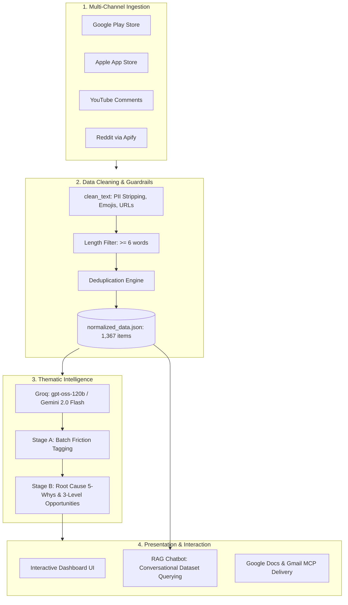

# Master Project Blueprint: AI Discovery Engine (Myntra Wishlist Conversion)

---

## 1. Executive Summary
The **AI Discovery Engine** is an automated product intelligence system designed to continuously ingest, clean, and synthesize thousands of real public customer reviews across the web to pinpoint why users abandon items in their shopping wishlists on Myntra.

Instead of relying on demographic guesswork or generic AI hallucinations, the engine establishes an evidence-grounded feedback loop:
- **Phase 1:** Ingests raw feedback across 4 distinct digital channels (Google Play, Apple App Store, YouTube, Reddit).
- **Phase 2:** Uses high-throughput LLMs (Groq / Gemini) to batch-tag friction themes, extract verified verbatim evidence, and perform root cause analysis (5 Whys).
- **Phase 3:** Delivers findings via an interactive Insights Dashboard equipped with a **RAG-based conversational PM assistant** and automated Google Docs/Gmail reporting via MCP.

---

## 2. Core Operating Principle & Problem Framing
**Operating Principle:**
*"The AI Discovery Engine will identify, quantify and compare the full range of factors that influence wishlist-to-purchase behaviour. It will not assume the underlying user problem in advance. Monetary barriers will be captured as genuine research findings, but monetary incentives will be excluded from the eventual solution space. The strongest actionable opportunity will be selected based on secondary research and subsequently validated through 5–6 targeted user interviews."*

- **The Observation:** E-commerce users save dozens of items to their wishlists, but only a fraction convert into bags and completed orders.
- **The Engine's Role:** Discover the unconstrained truth across all 13 core friction themes without bias or predetermined conclusions.
- **The Final Fellowship MVP:** The actual MVP will be conceptualized *after* the primary interviews validate the engine's findings. It will solve the validated user problem using the rigorous framing: *"Among [specific segment], users who [specific behavior] delay purchasing because [root cause]. They currently [workaround], which leaves them [consequence]."*

---

## 3. End-to-End System Architecture

---

## 4. NextLeap Fellowship Alignment & Grading Criteria

| Parameter | How This Engine Satisfies It |
| :--- | :--- |
| **Customer-Centric Problem** | Solves the user's psychological blocker (uncertainty, fee shock), not an internal business metric. |
| **Friction-Based Segmentation** | Segments the *problems* (e.g. Late-Stage Pricing Friction vs. Pre-Purchase Confidence Friction) instead of inventing hallucinated user personas. |
| **Root Cause Analysis (5 Whys)** | Goes beyond superficial symptoms to identify the emotional and operational root causes. |
| **Three-Level Creativity** | Solutions span Table Stakes (Level 1), Novel Product Flow (Level 2), and Moat-Building Data Advantage (Level 3). |
| **AI Transparency & Safety** | Documented token costs, rate-limit pacing, and automated verbatim quote provenance validation. |
| **Redacted Identity** | Fully anonymized for triple-blind evaluation. |

---

## 5. Artifact Directory Map

- [`docs/implementationplan.md`](file:///c:/Projects/AI%20Discovery%20engine/docs/implementationplan.md): Milestone-by-milestone technical task list.
- [`docs/architecture.md`](file:///c:/Projects/AI%20Discovery%20engine/docs/architecture.md): Subsystems, trust boundaries, and MCP data contracts.
- [`docs/arindam_feedback.md`](file:///c:/Projects/AI%20Discovery%20engine/docs/arindam_feedback.md): Grading rules and anti-assumption behavioral framework.
- [`docs/issue.md`](file:///c:/Projects/AI%20Discovery%20engine/docs/issue.md): Known edge cases, scraping constraints, and rate limits.
- [`docs/test.md`](file:///c:/Projects/AI%20Discovery%20engine/docs/test.md): Verification test cases and quote provenance scripts.
- [`docs/future_proposal.md`](file:///c:/Projects/AI%20Discovery%20engine/docs/future_proposal.md): Instagram scraper and RAG chatbot roadmap.
