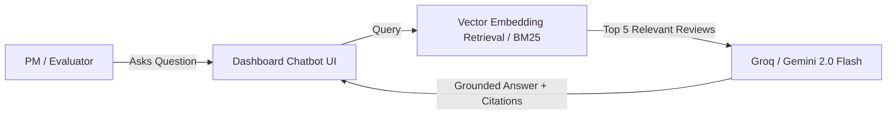

# Future Technical Proposal: AI Discovery Engine v2.0

This document outlines the strategic roadmap for expanding the AI Discovery Engine beyond the fellowship MVP.

---

## 1. Multi-Platform Expansion: Instagram & Influencer Feedback

### 1.1 Objective
Fashion discovery is overwhelmingly visual and Instagram-driven. Integrating Instagram user feedback captures top-of-funnel sentiment and styling confusion directly from Myntra's official reels and top influencer hauls.

### 1.2 Architecture
- **Tool:** Apify Instagram Comments Scraper (`apify/instagram-comment-scraper`).
- **Target Profiles:** `@myntra`, `@myntrafashionsuperstar`, and high-traffic hashtag posts (`#MyntraHaul`, `#MyntraSale`).
- **Data Extracted:** Comment text, like count, post caption, timestamp.
- **Normalization:** Filter out spam bots, emojis-only comments, and affiliate code promos.

---

## 2. Interactive RAG-Based Discovery Chatbot (Dashboard UI)

### 2.1 The Concept
Instead of reading a static dashboard or report, product leaders and fellowship evaluators can have an **interactive conversation with the raw 1,367+ customer reviews**.

### 2.2 Sample Prompts the Chatbot Can Answer
1. *"What is the #1 complaint regarding platform fees on checkout?"*
2. *"Are users having sizing problems with shoes or ethnic wear specifically?"*
3. *"Show me verbatim user quotes from Reddit about return pickup delays."*
4. *"What do users say about price increases after saving items in their wishlist?"*

### 2.3 Technical Stack for RAG
- **Vector DB / Index:** In-memory ChromaDB / FAISS or lightweight SQLite vector store.
- **Embeddings:** HuggingFace `all-MiniLM-L6-v2` or Google Gemini Text Embeddings (`text-embedding-004`).
- **Inference:** Groq (`openai/gpt-oss-120b`) or Gemini 2.0 Flash.

---

## 3. Historical Longitudinal Trend Engine (Week-over-Week)

- **Weekly Delta Analysis:** Automatically calculate:
  - Is `Price & Hidden Surcharges` rising or falling after the latest app release?
  - Did the new return policy update spike customer friction?
- **Automated Alerts:** Send Slack/Gmail webhook notifications when any friction theme spikes by >25% in a single week.

---

## 4. Automated PRD & Experiment Generator

Once the Discovery Engine identifies a high-scoring opportunity area (e.g., *Level 2: Transparent Total-Cart Pricing Calculator*), the engine can automatically draft:
- Problem framing with verbatim user quotes.
- Success metrics (Wishlist-to-bag conversion rate, checkout completion rate).
- Key acceptance criteria and edge cases.
- Out-of-scope boundaries to maintain lean scope.
